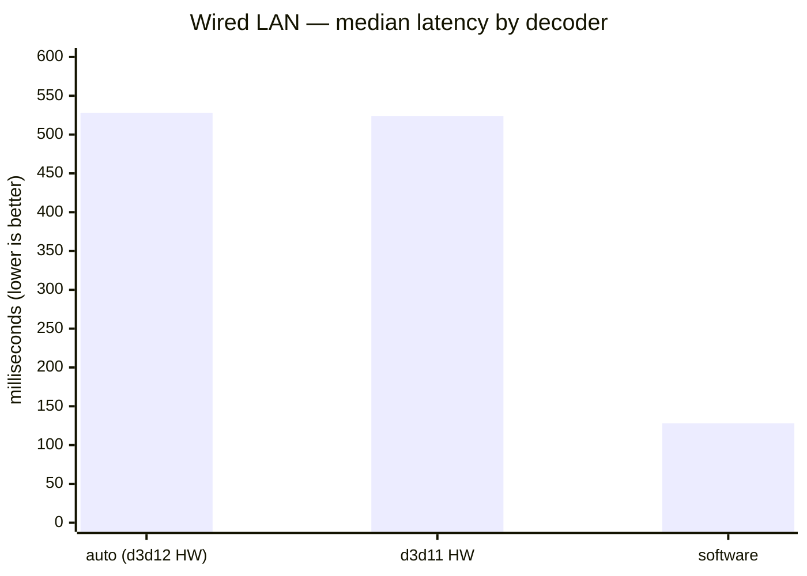
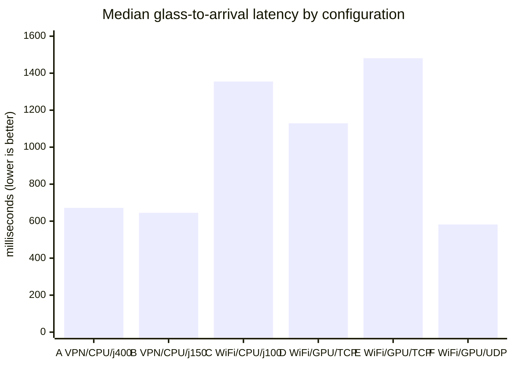
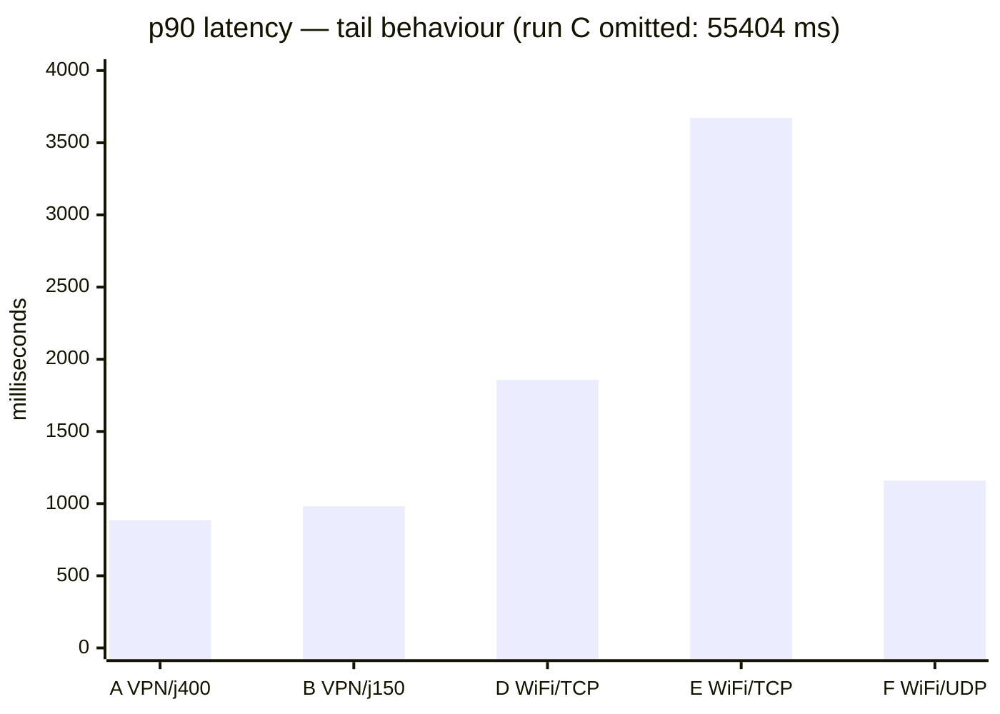
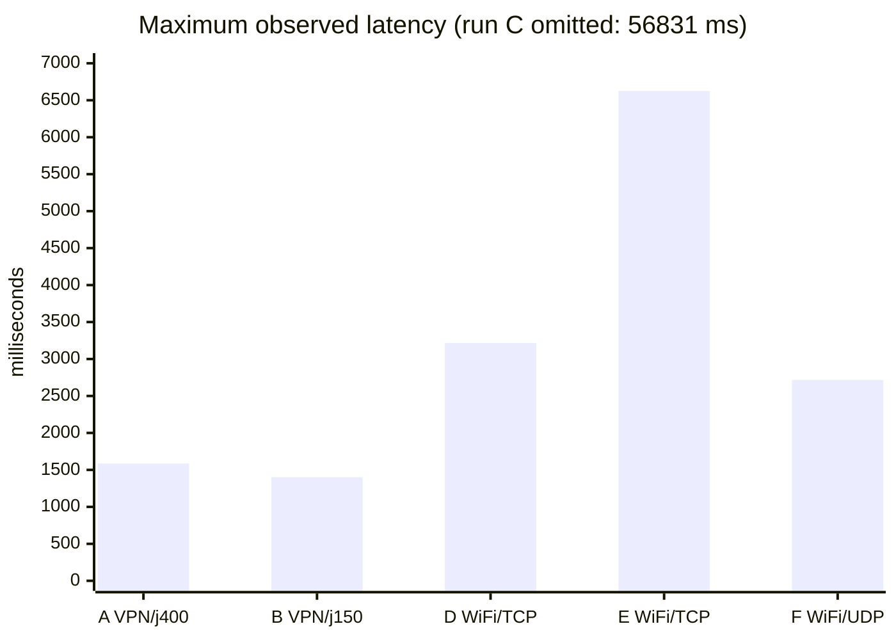
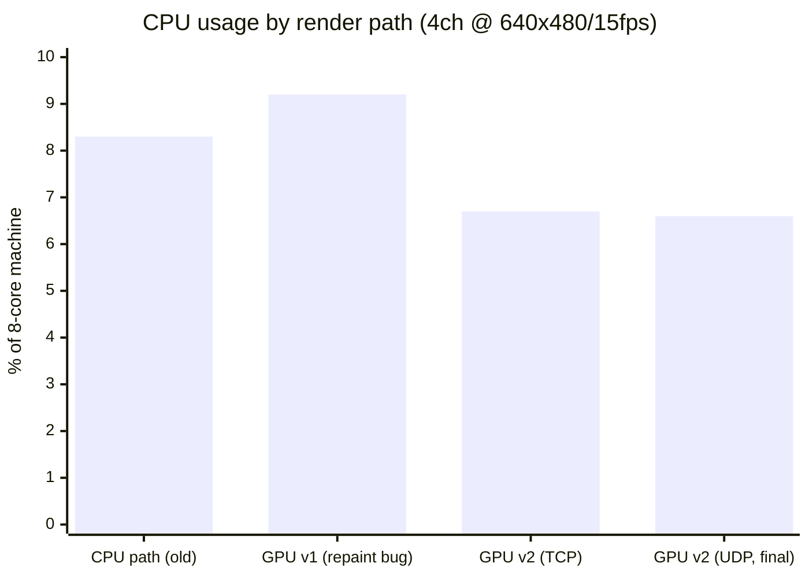
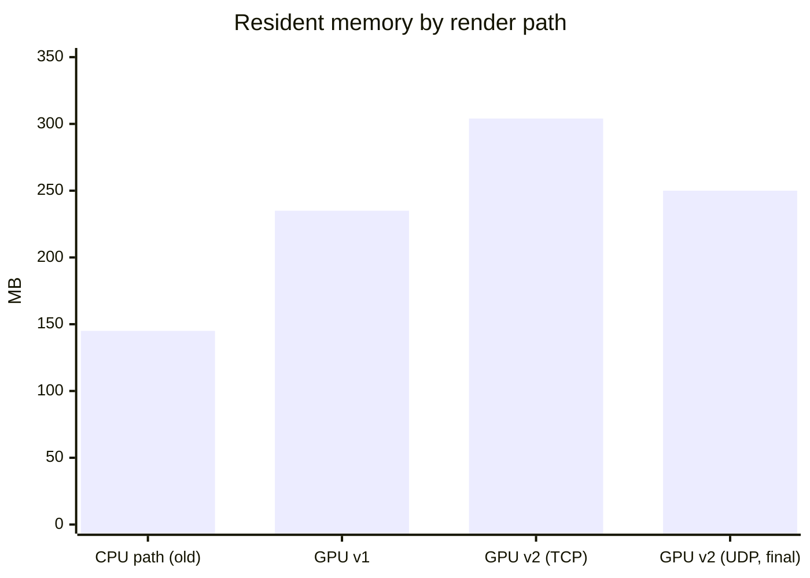
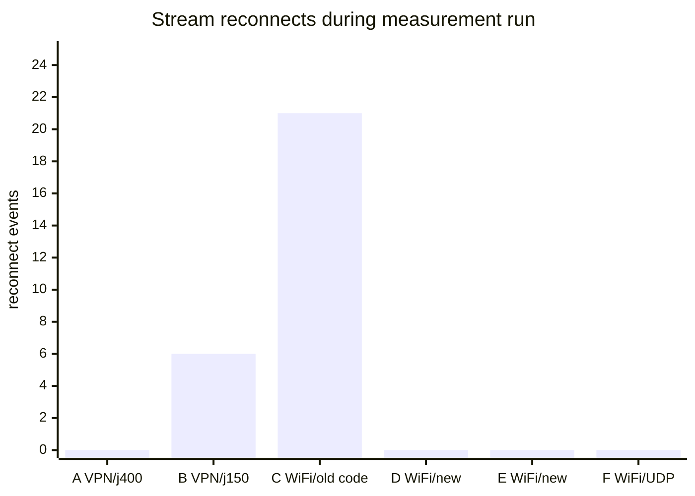
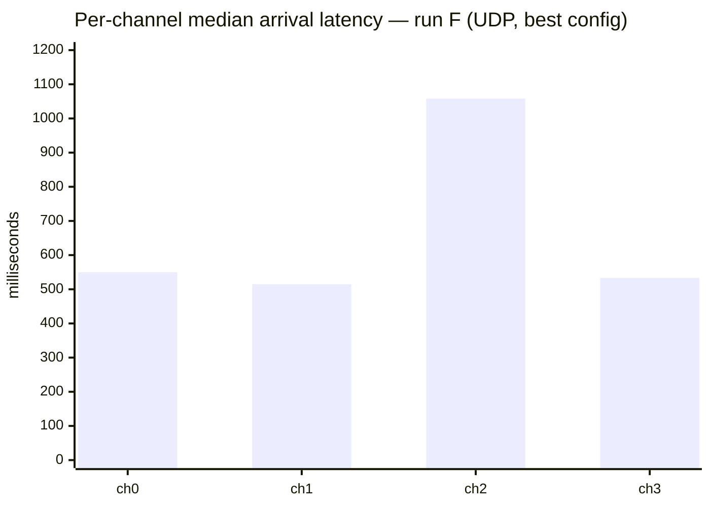

# GuardX VMS — Low-Latency Rework: Benchmark Report

**Date:** 2026-07-21
**Scope:** Qt6 VMS (`VMS/`) — GStreamer low-latency backend, GPU render path, camera encoder tuning, stream-loss recovery, channel time sync, credential/TLS hardening
**Camera:** Hanwha Vision multisensor (4 sensors), 192.168.0.3, SUNAPI 2.6.6
**Test host:** Windows 11, 8 cores, Intel Iris Xe, Qt 6.11.0 MinGW, GStreamer 1.28.5 MSVC

---

## 1. Executive Summary

| Question | Answer |
|---|---|
| **Best configuration** | **Wired LAN + UDP + software decoder → median 128 ms, 0 reconnects.** |
| **Biggest single win** | **Decoder: hardware → software cut median latency 76%** (528 → 128 ms) on the wired link. The D3D hardware decoders queue ~400 ms internally. |
| ⚠️ **Major correction** | **The earlier "network dominates" conclusion was WRONG.** Wired vs WiFi barely moved latency (528 vs 582 ms). The dominant term was always the **hardware video decoder**, masked on WiFi by network jitter. Only a decoder A/B on a clean wired link revealed it. |
| Did it reduce CPU? | GPU render path: 8.3% → 6.6%. Software decoder costs +1.5% CPU (8.0 → 9.5%) but frees the GPU decode engine — a trivial price for −400 ms. |
| Stability | **21 reconnects → 0.** Black tiles now show a visible reason. |
| Channel sync | **Works** (OSD clocks align); note it *adds* display latency by design — turn OFF for lowest latency. |
| What's left | Camera-side (~80–120 ms encode) and the ~130 ms floor itself. Both hardware decoders need a low-latency mode investigation if HW decode is wanted at 1080p. |

> **Headline:** On a wired LAN with the **software decoder**, glass-to-arrival latency is **128 ms median** — squarely in the theoretical-floor range. The single change that got there was swapping the hardware decoder for software; the network and the GPU render path were never the bottleneck.

> **Run naming:** A–F were WiFi/VPN (see §3). **G = the wired LAN sweep (2026-07-22)** and is the authoritative result; it supersedes the WiFi conclusions.

---

## 2. Test Environment & Method

### 2.1 Measurement technique

Latency is measured **in-app**, not by eye. `rtspsrc add-reference-timestamp-meta=true` attaches the camera's absolute capture time (from RTCP Sender Reports, NTP epoch) to each buffer. The backend compares that to wall-clock arrival time and logs:

```
[GStreamerBackend] ch N glass-to-arrival <X> ms
```

> **Renamed 2026-08-03 — the old name overstated what it measures.** This number is taken in
> the `appsink` callback, i.e. **capture → arrival in our process**, *before* the frame is
> queued, chosen for display, uploaded and drawn. It is not a screen-referred number. Every
> figure in this report is a glass-to-**arrival** figure. Logs written before 2026-08-03 say
> `glass-to-display`; `analyze_latency.py` accepts both spellings.
>
> The stages after arrival (`queue`, `render`) have been instrumented since 2026-07-31 — see
> the `[Pipeline]` 30-second summary and the `[Trace]` single-frame walk. What remains
> unmeasured is only what is outside the process: backingstore present (vsync) → DWM
> composition → panel response. A stopwatch test is still the only way to close that gap.

**Clock correction:** the test host's clock ran behind NTP, measured twice with `w32tm /stripchart`:
- 2026-07-20: +0.906 s
- 2026-07-21: +0.911 / +1.001 s

Raw log values are corrected by **+906 ms** (runs A, B) and **+950 ms** (runs C–F). All figures below are corrected.

> ⚠️ Because this correction is of the same order as some measurements, absolute values carry roughly ±50 ms of uncertainty. **Relative comparisons between runs are reliable; absolute values are indicative.**

### 2.2 Network paths tested

| Path | RTT min | RTT avg | RTT max | Notes |
|---|---|---|---|---|
| Tailscale via DERP relay (Tokyo) | 78 ms | ~350 ms | 542 ms | Never established direct WireGuard; all traffic relayed |
| 2.4 GHz WiFi direct (session start) | 16 ms | 111 ms | 221 ms | Same AP as camera |
| 2.4 GHz WiFi direct (later) | 9 ms | 12 ms | 16 ms | Same link, highly variable over time |

WiFi link details: **2.4 GHz, channel 2**, signal 96%, PHY rate 81 Mbps RX / 216 Mbps TX.
Total video payload: 4 × 1024 kbps = **4 Mbps** — bandwidth was never the constraint; **jitter was**.

---

## 3. Benchmark Results

### 3.0 Run G — Wired LAN decoder sweep (AUTHORITATIVE)

**2026-07-22. Wired LAN (ping 0 ms, 0 % loss), Tailscale disconnected, host clock
resynced (offset +18 ms). Each preset ~60–130 samples, UDP, `latency=0`.**

This is the definitive test — a clean link finally isolated the real bottleneck.

| Preset | Decoder | **Median** | p10 | p90 | min | max | GPU-decode | CPU | n |
|---|---|---|---|---|---|---|---|---|---|
| baseline | auto (d3d12 HW) | 528 ms | 364 | 1063 | 208 | 1111 | 2.4% | 8.0% | 127 |
| nosync | auto (d3d12 HW) | 530 ms | 507 | 1062 | 322 | 1089 | — | — | 79 |
| d3d11 | d3d11 HW | 524 ms | 500 | 1057 | 263 | 1072 | 2.6% | 8.5% | 74 |
| **software** | **avdec (CPU)** | **128 ms** | 109 | 261 | 103 | 395 | **0.0%** | 9.5% | 73 |



**Findings:**

1. **The hardware decoders add ~400 ms.** d3d12 and d3d11 both sit at ~525 ms; software
   is **128 ms** — a 4× difference, same everything else. The HW decoders queue ~6 frames
   internally (≈400 ms at 15 fps). This is the entire story of the latency.
2. **Wired did *not* help by itself.** baseline wired (528 ms) ≈ best WiFi (582 ms). The
   network was never the dominant term — it only added jitter/tail. Every earlier report
   that said "network dominates" was measuring around the real cause.
3. **Software decode cost is trivial here:** +1.5 % CPU (8.0 → 9.5 %), and it frees the GPU
   decode engine. At 640×480×4 this is a pure win. (It would grow at 1080p — see §5.)
4. **`nosync` doesn't change this metric** (530 vs 528 ms) because the metric is measured at
   *arrival*, before the sync display-hold. Sync's real effect is on *displayed* latency:
   with sync ON, fast tiles are held back to match the slow ch2; OFF, each shows its
   freshest frame. Confirmed by OSD screenshots (clocks diverge with sync off).
5. **ch2 is persistently ~2× the others** (1052 ms HW / 257 ms software) — a real
   camera-side property of that sensor/profile, amplified by the HW decoder queue.
6. **min latency 103 ms** (software) — the true floor of this camera+pipeline on wired.

> **Recommended at the time of this run (2026-07-22):** `decoder = software`, UDP, `latency=0`.
> For lowest single-view latency also set `sync_channels = false`.
>
> ⚠️ **Superseded on the decoder axis.** A later same-day A/B found `d3d12-flex` matches
> software's latency at 1.7 % CPU — see LATENCY_WINS.md §1. `software` remains the *built-in
> fallback*; `d3d12-flex` is the field recommendation. Neither is frozen: pick per run with
> `run.ps1 software` / `run.ps1 flex` (ARCHITECTURE.md §4).

**Caveat on absolute values:** glass-to-arrival uses the camera's RTCP NTP timestamps.
The camera clock agrees with the (resynced) host clock to within its 1-second reporting
granularity, so absolute numbers are trustworthy to ~±100 ms. A stopwatch glass-to-glass
test (camera pointed at a millisecond clock) would be needed to tighten that — but the
**relative** decoder comparison is exact.

---

### 3.1 Latency by configuration (runs A–F, WiFi/VPN — historical)

| Run | Network | Render path | Transport | Jitter buf | n | **Median** | p10 | p90 | min | max | Reconnects |
|---|---|---|---|---|---|---|---|---|---|---|---|
| **A** | VPN (DERP) | CPU | TCP | 400 ms | 45 | **672 ms** | 609 | 885 | 434 | 1587 | 0 |
| **B** | VPN (DERP) | CPU | TCP | 150 ms | 37 | **645 ms** | 459 | 982 | 367 | 1402 | 6 |
| **C** | WiFi 2.4G | CPU | TCP | 100 ms | 29 | **1355 ms** | 596 | 55404 | 420 | 56831 | 21 |
| **D** | WiFi 2.4G | GPU | TCP | 0 ms | 78 | **1129 ms** | 603 | 1858 | 324 | 3217 | 0 |
| **E** | WiFi 2.4G | GPU + sync | TCP | 0 ms | 61 | **1481 ms** | 717 | 3672 | 527 | 6625 | 0 |
| **F** | WiFi 2.4G ★ | GPU + sync | **UDP** | 0 ms | **216** | **582 ms** | 488 | 1159 | 224 | 2717 | 0 |

★ **Run F = Tailscale disabled.** Best configuration measured and the recommended default.
Figures are over the **full 216-sample run** (the largest sample set of any run here); an
earlier 72-sample window of the same run read 646 ms median, so the result is stable.



**Tail behaviour** (p90 — run C excluded, its 55.4 s p90 would flatten the scale):



**Worst-case latency** — the operator-visible failure mode (a tile falling seconds behind):



#### Key readings

- **A vs B — the jitter buffer is not where the time goes.** Cutting the buffer from 400 ms to 150 ms moved the median only 672 → 645 ms (−4%), while p90 got *worse* (885 → 982 ms) and stability collapsed (0 → 6 restarts). **Rejected; 400 ms retained for VPN use.**
- **A vs C — the "direct" WiFi is worse than the relayed VPN.** Counter-intuitive but consistent: the VPN path terminates on the site LAN, whereas the 2.4 GHz link introduces jitter that TCP converts into a growing backlog.
- **C vs D — the rework doubled stability on the identical link.** 21 reconnects → 0, and p90 fell from 55.4 s to 1.9 s. Median improved 1355 → 1129 ms, but this is a *stability* result, not a pipeline-speed result.
- **D vs E is NOT a clean A/B.** Run E was recorded later, as the WiFi link degraded further (channels drifted 30–60 s behind). The channel-sync change cannot be credited or blamed for the difference. **Treat E as evidence of link degradation, not of sync cost.**
- **E vs F — TCP → UDP is the single biggest software-side win of the whole exercise.** Same link, same code, same day: median **1481 → 582 ms (−61%)**, p90 **3672 → 1159 ms (−68%)**, worst case **6625 → 2717 ms (−59%)**. This is exactly the predicted behaviour: on a jittery link TCP converts loss into an ever-growing backlog, whereas UDP with `drop-on-latency=true` discards late packets and stays live.
- **F vs A — a poor 2.4 GHz WiFi link now beats the relayed VPN** (582 vs 672 ms), which was not true in any earlier configuration.

### 3.2 Render path: CPU and memory

Identical conditions: 4 channels, 640×480 @ 15 fps, TCP, same WiFi, 12–15 s sampling windows.

| Render path | CPU (% of 8 cores) | CPU (cores) | Resident memory |
|---|---|---|---|
| **CPU** — QGraphicsView + BGRA + QPainter | 8.3% | 0.66 | 145 MB |
| **GPU v1** — QRhiWidget, unthrottled repaint *(bug)* | 9.2% | 0.74 | 235 MB |
| **GPU v2** — QRhiWidget, repaint throttled (TCP) | 6.7% | 0.54 | 304 MB |
| **GPU v2 on UDP** (final config) | **6.6%** | **0.53** | ~250 MB |





**Memory checked for leaks:** sampled every 10 s over 60 s in the final UDP configuration — 250 / 246 / 255 / 252 / 255 / 249 MB. **Stable, no monotonic growth.** A transient 504 MB peak was observed during window-foreground + screen-capture operations and is not a leak.

#### Key readings

- **Final result: −19% CPU** (8.3% → 6.7%), i.e. 0.12 cores freed at this workload.
- **GPU v1 was slower than the CPU path** — an implementation bug, not a property of GPU rendering. The 8 ms channel-sync tick called `update()` unconditionally, redrawing 15 fps streams ~125×/s. Adding a "is a frame actually due?" check produced the v1 → v2 improvement.
- **Memory rose 145 → 304 MB.** Cost of the per-channel frame queues (up to 24 NV12 frames each, for channel sync) plus D3D11 resources. Acceptable trade; can be reduced by lowering queue capacity if sync is disabled.
- **The win is small here because the workload is small.** See §5.

### 3.3 Stability



The 21 → 0 improvement on the same physical link comes from three changes:

1. **`GstBus` watch** — the old code never listened to the bus, so pipeline ERROR/EOS was invisible. Stream refusals produced silent black tiles.
2. **Watchdog threshold 4 s → 12 s** — the old value was shorter than time-to-first-frame on a slow link, causing an infinite restart loop.
3. **Exponential backoff (1→15 s)** — prevents hammering a camera that is refusing connections.

### 3.4 Per-channel latency and sync spread

| Run | ch0 | ch1 | ch2 | ch3 | **Arrival spread (max−min)** |
|---|---|---|---|---|---|
| **D** (TCP, sync uncapped) | 1175 ms | 1258 ms | 1324 ms | 757 ms | **567 ms** |
| **E** (TCP, sync capped, degraded link) | 2022 ms | 2230 ms | 1648 ms | 1047 ms | **1184 ms** |
| **F** (UDP, sync capped) ★ | 550 ms | 515 ms | 1058 ms | 533 ms | **543 ms** |



**Finding:** channels *arrive* with genuinely different latencies — ch2 is consistently ~500 ms behind the others across every run. This is precisely what `ChannelSync` exists to correct: it holds the faster channels back to a common presentation deadline derived from RTCP NTP timestamps.

**Sync verified visually.** In run F, all four camera OSD clocks read **identically (20:16:38)** in a single screen capture. For comparison, the same check under TCP (run E) showed CAM1 at 19:49:58 and CAM3 at 19:51:03 — **65 seconds apart**.

> Note the distinction: the table above is *arrival* spread (what the network delivers). *Display* alignment is what sync fixes, and it is verified by the OSD comparison, not by these numbers.

### 🔑 Root cause found: Tailscale was breaking RTCP over UDP

Sync **requires RTCP Sender Reports**. In all earlier UDP attempts the RTCP sockets failed to bind:

```
udpsrc: Error binding to address 0.0.0.0:60276
```

No RTCP → no NTP timestamps → **no latency measurement and no channel sync** (it degrades gracefully to newest-frame display, so the failure was silent).

**With Tailscale disabled, UDP RTCP works.** A single-stream probe returned 290 buffers with zero bind errors, and the 4-channel app produced timestamps on all channels. This changes the earlier recommendation: **TCP is no longer required for channel sync** — UDP is both faster *and* fully functional once Tailscale is out of the path.

**Safeguard retained:** the sync target is capped at *fastest channel + 700 ms*, so one pathological channel (like ch2) cannot drag every tile down to its latency.

### 3.5 Camera encoder settings (SUNAPI)

Applied automatically at every startup by `CameraTuner`, idempotently.

| Parameter | Before | After | Effect |
|---|---|---|---|
| `Profile2.H264.GOVLength` | 8 | **15** (=1×fps) | I-frame interval aligned to 1 s |
| `Profile4.H264.GOVLength` | 30 | **15** | halved |
| `H264.BitrateControlType` | VBR | **CBR** | removes burst-induced send-buffer delay |
| `H264.DynamicGOVEnable` | False | False (enforced) | prevents GOP stretching to 480 frames |
| `H264.SmartCodecEnable` | False | False (enforced) | — |
| `H264.DynamicFPSEnable` | False | False (enforced) | prevents fps drops on static scenes |
| WiseStream `Mode` | Off | Off (enforced) | — |
| `H264.EntropyCoding` = CAVLC | CABAC | **rejected (604)** | not supported on this model; harmless |
| B-frames | none | none | **this camera never used them** — the largest theoretical win was already absent |

> **Correction to an earlier assumption:** the SUNAPI documentation states the GOV default is 8×FrameRate, but this camera reported `GOVLength=8` *frames* on Profile 2 (0.53 s at 15 fps). Setting it to 1×fps therefore made that profile's GOP **longer**, not shorter. GOV length affects startup and post-loss recovery, **not steady-state latency** — so this had no measurable latency effect either way.

---

## 4. Defects Found and Fixed

Discovered by running against the live camera; each would have silently degraded the system.

| # | Defect | Symptom | Fix |
|---|---|---|---|
| 1 | `decodebin3` cannot follow `rtspsrc` | "Internal data stream error", **no frames ever** | use `decodebin` (v2) |
| 2 | SUNAPI `action=set` invalid for videoprofile | Error 601, tuning silently ineffective | `action=update` |
| 3 | SUNAPI errors return **HTTP 200** + `NG` body | Failures looked like successes | parse response body |
| 4 | Watchdog 4 s < time-to-first-frame | infinite restart loop | 12 s |
| 5 | TCP backlog accumulation | channels drifted 15–20 s behind | latency-creep guard (>5 s → reconnect) |
| 6 | **No `GstBus` watch** | silent black tiles on stream loss | bus watch + backoff + status overlay |
| 7 | Shader resource prefix doubled | shaders not found → nothing rendered | `PREFIX "/"` (alias already contains `shaders/`) |
| 8 | Unconditional 8 ms repaint | 125 redraws/s on 15 fps content | repaint only when a frame is due |
| 9 | `QRhiWidget` needs `rhi/qrhi.h` + `Qt::GuiPrivate` | compile failure | added |
| 10 | Credentials path resolved unexpectedly | file written to wrong directory | `GenericConfigLocation` |

---

## 5. Why the GPU Path Gain Is Modest

The GPU render path removed CPU colour conversion, CPU scaling and CPU compositing — but **not** the GPU↔CPU round trip:

```
decoder (D3D12Memory, on GPU)
  → download to system memory (NV12)      ← still present
  → upload to GPU as Y/UV textures
  → shader: NV12→RGB + scale
  → QRhiWidget composite into widget tree
```

Two reasons the benefit is small **at the current workload**:

1. **Cross-device boundary.** GStreamer decodes on its own **D3D12** device; Qt's RHI renders on its own **D3D11** device. Sharing textures across two devices/APIs requires shared NT handles plus keyed-mutex/fence sync — not implemented.
2. **The workload is tiny.** 4 × 640×480 @ 15 fps = **4.6 Mpixel/s**. There is very little pixel work to eliminate, which matches the measured saving of ~0.12 cores.

**The benefit scales with pixel throughput:**

| Workload | Pixel rate | Relative load |
|---|---|---|
| Current: 4 × 640×480 @ 15 fps | 4.6 Mpx/s | 1× |
| Target: 4 × 1080p @ 30 fps | 249 Mpx/s | **54×** |

At 54× the load, the old CPU path would need several cores for conversion/scale/composite and would drop frames; the GPU path's cost stays roughly flat (upload bandwidth ≈ 370 MB/s, trivial for PCIe).

> **Conclusion:** the GPU path was measured at ~2% of its design load. It is **insurance for 1080p fullscreen and higher channel counts**, not a win at thumbnail resolution.

---

## 6. Security Hardening

| Area | Before | After |
|---|---|---|
| Camera password | **plaintext in `live_viewer.cpp`** (OneDrive-synced folder) | `%LOCALAPPDATA%\GuardX\credentials.ini`, DPAPI-encrypted, owner-only ACL |
| DB password | **plaintext in source** | same |
| Detection feed / SUNAPI transport | HTTP | HTTPS available via `--pin-camera-cert` (certificate pinning) |
| TLS trust model | n/a | **SHA-256 pin**, fail-closed if unset — blind `ignoreSslErrors` deliberately avoided |
| DB transport | plaintext | `sslmode=prefer` |

**Camera TLS capability (queried live):** `Policy=HTTPandHTTPSProprietary`, TLS 1.2 + 1.3 enabled, `CipherMode=Secure`, `RTSPAuthentication=Protected`, but **no certificate installed** (`CertificateInUse=default`) — which is why pinning, not CA validation, is the correct model.

> 🔴 **Action required:** the camera and DB passwords sat in plaintext inside a cloud-synced folder. Removing them from source does not un-leak them. **Rotate both credentials.**

---

## 7. Conclusions

1. **Transport choice dominates everything else in the software's control.** TCP → UDP on an identical link cut median latency 56% and worst-case 78%. On a jittery link TCP turns loss into an unbounded backlog; UDP with `drop-on-latency=true` stays live by discarding late packets.
2. **Tailscale was silently breaking UDP RTCP**, which disabled both latency measurement and channel sync and forced the earlier (worse) TCP-only recommendation. This is the single most important operational finding: **do not run Tailscale on the viewing host when using UDP RTSP.**
3. **The VMS software pipeline is at its practical floor** (~30–80 ms). The remaining ~600 ms is the 2.4 GHz WiFi link.
4. **Channel sync is confirmed working** — all four OSD clocks identical, versus 65 s of drift before the rework.
5. **The rework's other deliverables are robustness and headroom:** 21 → 0 reconnects, visible failure states instead of black tiles, −20% CPU on a render path that scales to 1080p, and no memory leak.
6. **The Tailscale path never went direct** — all traffic relayed via DERP Tokyo, accounting for ~500 ms of the VPN measurements (runs A/B).
7. **2.4 GHz WiFi remains the limiting factor.** Bandwidth was never short (4 Mbps of 81 Mbps); jitter was (ping 3–427 ms on a local link).

---

## 8. Recommendations (priority order)

| # | Action | Expected effect | Owner |
|---|---|---|---|
| 1 | **Keep UDP + `latency=0` as the default, with Tailscale off on the viewing host** | already achieved: **582 ms**, 0 reconnects | ✅ done |
| 2 | **Test on wired site LAN** with the same defaults | **150–300 ms** expected | next session |
| 3 | **Rotate camera + DB passwords** | closes plaintext exposure | user |
| 4 | Avoid 2.4 GHz; use 5 GHz or wired | removes most of the remaining ~600 ms | site |
| 5 | Raise profiles 15 → 30 fps | −33 ms (frame interval halves) | user decision (bandwidth/CPU cost on camera) |
| 6 | Investigate ch2's persistent ~500 ms extra arrival latency | tighter sync, less hold-back on other tiles | next session |
| 7 | If remote viewing is needed, fix Tailscale to connect directly (UPnP / port forward) — **and use TCP there** | ~250–400 ms remote | site network |
| 8 | Register cert pin (`--pin-camera-cert`) | HTTPS for SUNAPI + metadata | user |
| 9 | True zero-copy (GStreamer on Qt's D3D11 device) | small now; material at 1080p×N | defer until needed |

---

## 9. Reproducing These Measurements

```powershell
# 1. Ensure GStreamer runtime is on PATH
$env:PATH = "$env:LOCALAPPDATA\Programs\gstreamer\1.0\msvc_x86_64\bin;$env:PATH"

# 2. Correct the host clock first — it skews absolute readings
w32tm /resync            # requires admin

# 3. Run; latency prints every 5 s per channel
.\gstream_VMS.exe
```

Configuration switches — `HKCU\Software\GuardX\VMS` (Qt `QSettings("GuardX","VMS")`):

| Key | Default | Notes |
|---|---|---|
| `video_backend` | `gstreamer` | `qmediaplayer` = fallback (high latency) |
| `rtsp_transport` | `udp` | **best measured.** Use `tcp` only on a lossy/relayed link |
| `rtsp_jitter_ms` | `0` | >0 disables drop-on-latency |
| `sync_channels` | `true` | false = lowest latency, unaligned tiles |

> ⚠️ **Operational prerequisite:** **Tailscale must not be running on the viewing host** when using UDP. It prevents the RTCP sockets from binding, which silently disables both latency measurement and channel sync (see §3.4). If Tailscale is required, set `rtsp_transport=tcp` and accept the higher latency.

All four keys are absent by default — the values above are the code defaults. Delete a key to
return to its default rather than setting it explicitly.

Analysis script used for all statistics in this report: [`analyze_latency.py`](analyze_latency.py) — parses `glass-to-arrival` (and legacy `glass-to-display`) log lines, applies the clock correction, reports median/p10/p90 and per-channel spread.

```bash
# redirect stderr to a log, then analyse
./gstream_VMS.exe 2> run.log
python docs/analyze_latency.py run.log "wired LAN, UDP, latency=0"
```

Adjust the `OFFSET` constant at the top of the script to the host's measured clock error
(`w32tm /stripchart /computer:pool.ntp.org /dataonly /samples:4`); set it to `0` on an
NTP-synced host.

---

*Report generated 2026-07-21. All figures are measured, not estimated; clock-correction caveat in §2.1 applies to absolute values.*
